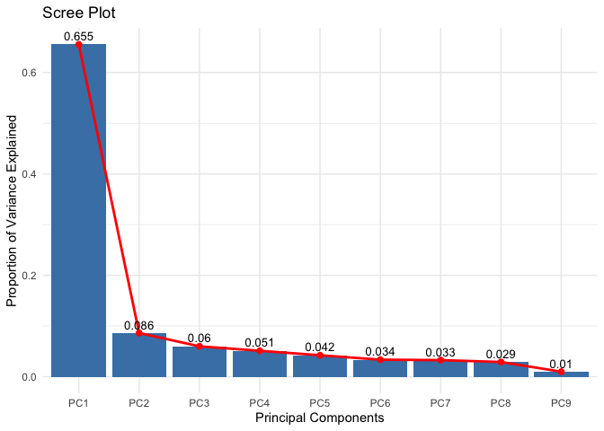
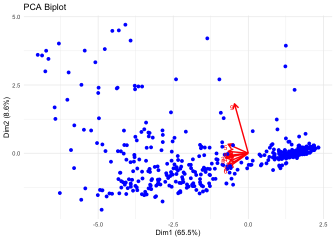
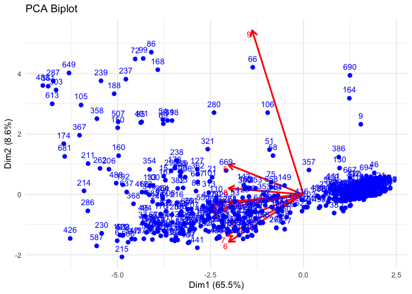

<!-- README.md is generated from README.Rmd. Please edit that file -->

# multipca

<!-- badges: start -->
<!-- badges: end -->

The goal of multipca is to provide a comprehensive set of tools for
performing and visualizing Principal Component Analysis (PCA). This
package simplifies the process of conducting PCA on multivariate data
and helps users gain insights into the structure and relationships
within their data.

With multipca, you can:

Perform PCA: Use the my_prcomp() function to perform PCA on any dataset,
with options for centering and scaling the data. Visualize Explained
Variance: Create scree plots with screeplot_variance() to easily
visualize the proportion of variance explained by each principal
component. Generate Biplots: Use the pca_biplot() function to create
biplots that display both observations and variable loadings in the PCA
space, with options to customize the plot and highlight groupings within
the data. Summarize PCA Results: The summary.my_prcomp() function
provides a detailed summary of the PCA results, including the standard
deviations, proportion of variance, and cumulative variance explained by
each component. multipca is designed to be user-friendly, making it
easier for analysts, data scientists, and researchers to explore and
interpret their multivariate data through PCA.

## Installation

You can install the development version of multipca from
[GitHub](https://github.com/) with:

``` r
# install.packages("devtools")
# install.packages("ggplot2")
devtools::install_github("MarvinWintersteller/MarvinWinterstellerMulti")
```

## Example

This is a basic example which shows you how to solve a common problem:

``` r
library(multipca)
#> Lade nötiges Paket: ggplot2
## basic example code

# Load the cleaned biopsy dataset
data("biopsy_sample") #Lazy Loading
head(biopsy_sample)
#>   V1 V2 V3 V4 V5 V6 V7 V8 V9
#> 1  5  1  1  1  2  1  3  1  1
#> 2  5  4  4  5  7 10  3  2  1
#> 3  3  1  1  1  2  2  3  1  1
#> 4  6  8  8  1  3  4  3  7  1
#> 5  4  1  1  3  2  1  3  1  1
#> 6  8 10 10  8  7 10  9  7  1
str(biopsy_sample)
#> 'data.frame':    683 obs. of  9 variables:
#>  $ V1: int  5 5 3 6 4 8 1 2 2 4 ...
#>  $ V2: int  1 4 1 8 1 10 1 1 1 2 ...
#>  $ V3: int  1 4 1 8 1 10 1 2 1 1 ...
#>  $ V4: int  1 5 1 1 3 8 1 1 1 1 ...
#>  $ V5: int  2 7 2 3 2 7 2 2 2 2 ...
#>  $ V6: int  1 10 2 4 1 10 10 1 1 1 ...
#>  $ V7: int  3 3 3 3 3 9 3 3 1 2 ...
#>  $ V8: int  1 2 1 7 1 7 1 1 1 1 ...
#>  $ V9: int  1 1 1 1 1 1 1 1 5 1 ...

# Perform PCA
biopsy_pca <- my_prcomp(biopsy_sample, scale. = TRUE)

# Print the PCA summary
summary.my_prcomp(biopsy_pca)
#> Importance of components:
#> 
#>     Standard deviation Proportion of Variance Cumulative Proportion
#> PC1          2.4288885            0.655499928             0.6554999
#> PC2          0.8808785            0.086216321             0.7417162
#> PC3          0.7343380            0.059916916             0.8016332
#> PC4          0.6779583            0.051069717             0.8527029
#> PC5          0.6166651            0.042252870             0.8949558
#> PC6          0.5494328            0.033541828             0.9284976
#> PC7          0.5425889            0.032711413             0.9612090
#> PC8          0.5106230            0.028970651             0.9901796
#> PC9          0.2972932            0.009820358             1.0000000

# Create a scree plot
screeplot_variance(biopsy_pca)
```



``` r

# Create a biplot

# Customize biplot with longer arrows
pca_biplot(biopsy_pca, arrow_multiplier = 2)  # Verwende einen höheren Multiplikator für längere Pfeile
```



``` r
pca_biplot(biopsy_pca, arrow_multiplier = 6, obs_labels = rownames(biopsy_sample))
```



You’ll still need to render `README.Rmd` regularly, to keep `README.md`
up-to-date. `devtools::build_readme()` is handy for this.

In that case, don’t forget to commit and push the resulting figure
files, so they display on GitHub and CRAN.
